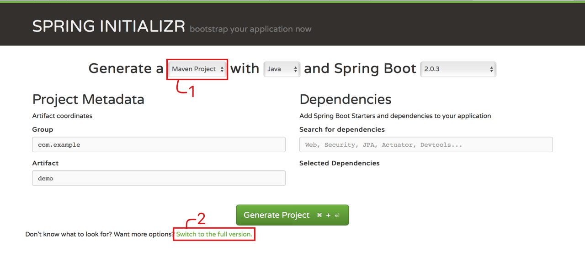
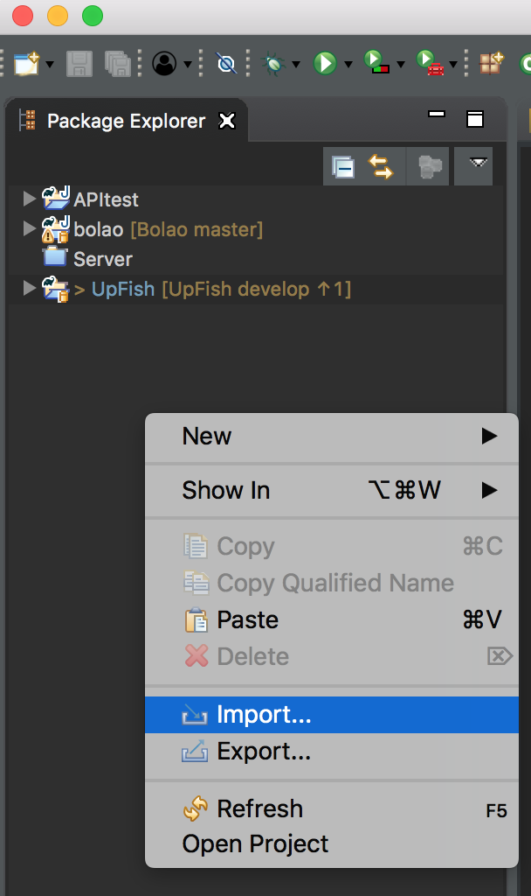
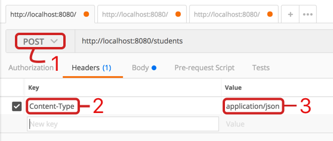
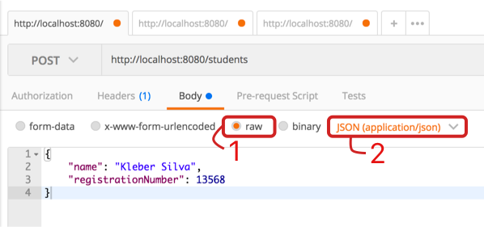

# Tutorial - RESTful API com Spring

## REST
É um estilo de arquitetura que define um conjunto de restrições e propriedades baseados em HTTP. Web Services que obedecem ao estilo arquitetural REST são chamados RESTful e fornecem interoperabilidade entre sistemas de computadores na Internet. Os web services compatíveis com REST permitem que os sistemas solicitantes acessem e manipulem representações textuais de recursos da Web usando um conjunto uniforme e predefinido de operações **sem estado**.

### Métodos HTTP
#### GET
Requisição de informação:

`http://localhost:8080/teams`

```json
[
    {
        "id": 1,
        "name": "Russia"
    },
    {
        "id": 2,
        "name": "Saudi Arabia"
    },
    {
        "id": 3,
        "name": "Egypt"
    },
    {
        "id": 4,
        "name": "Uruguay"
    },
    {
        "id": 5,
        "name": "Portugal"
    }
]
```
#### POST
Inserção de informação:

`http://localhost:8080/teams`

```json
{
	"id": 6,
	"name": "Spain"
}
```
#### PUT
Atualização de informação:

`http://localhost:8080/teams/5`

```json
{
	"id": 5,
	"name": "New Name"
}
```

#### DELETE
Remoção de informação:

`http://localhost:8080/teams/5`


## Construção de uma API com Spring
O **Spring MVC** é um framework que ajuda no desenvolvimento de aplicações web. Com ele é possível construir aplicações web robustas e flexíveis. Ele já tem todas as funcionalidades necessárias para atender requisições HTTP, delegar responsabilidades de processamento de dados para outros componentes e preparar a resposta que precisa ser dada.  
O **Sring Boot** é um projeto da Spring que visa facilitar o processo de configuração e publicação de aplicações. Basta indicar quais módulos deseja utilizar (WEB, Persistência, Segurança, etc.) que ele reconhece e configura com as convenções padrões.  
Vamos criar um servidor simples que fornceça informações sobre uma escola.

### Ferramentas
Para codificar a aplicação será utilizada a [IDE Eclipse](https://www.eclipse.org/downloads/download.php?file=/oomph/epp/oxygen/R2/eclipse-inst-mac64.tar.gz).  
Para realizar requisições será utilizado o [Postman](https://www.getpostman.com/apps).  

### 1 - Criando o projeto
Para facilitar a criação do projeto vamos utilizar o [Spring Initializr](https://start.spring.io), que cria automaticamente um projeto Spring Boot uma vez selecionados os módulos.  

  
Em *Group* e *Artifact* coloque o Bundle ID `com.example` e nome SpringTutorial para seu projeto.  
Mude o tipo de projeto [1] para Gradle.  
Clique em *Switch to the full version* [2] para ver todos os módulos selecionáveis. Selecione o módulo Web na categoria Web e os módulo JPA e Apache Derby na categoria SQL.  
Clique em **Generate Project**.

### 2 - Importando o projeto no Eclipse
  
Dentro do Packet Manager do Eclipse, clique com o botão direito e escolha *Import*. Selecione *Gradle* e depois *Existing Gradle Project*. Em *Project Root Directory* escolha a pasta que foi criada pelo *Spring initializr* e clique em *Finish*.

### 3 - Criando Endpoints
Endpoints são os pontos de acesso à API. Dentro da arquitetura MVC, eles são criados dentro de Controllers. Assim, vamos criar um novo Package com o nome `com.example.SpringTutorial.controller` e uma nova classe Java nesse pacote, com o nome TestController.  
A forma que informamos ao Spring que a classe é um Controller que fornece endpoints é através da anotação `@RestController`.

```java
@RestController
public class TestController {

}
```

Cada endpoint no Controller é mapeado para uma função. Para indicar o caminho mapeado para a função, utilizamos a anotação `@RequestMapping({path})`. Vamos então criar um endpoint que retorne `Hello World`:

```java
@RequestMapping("/hello")
public String helloWorld() {
	return "Hello World";
}
```

Execute a aplicação . Utilizando o Postman ou em um navegador, faça uma requisição GET: `http://localhost:8080/hello`. A string "Hello World" deve ser impressa.  

**PS1:** Pode ser necessario clicar duas vezes em *Play* para executar a aplicação, uma para a atualização do Gradle e outra para a execução em si.  
**PS2:** Caso a aplicação apresente um erro informando que a porta 8080 já está sendo usada, utilize o Activity Manager para finalizar as aplicações Java.


### 4 - Criação do Model
Vamos criar classes para representar alunos e professores no nosso servidor. Para indicar para o Spring que as classes são entidades, elas devem ser anotadas com `@Entity`. Para indicar que uma propriedade é relativa ao ID da entidade, ela deve ser anotada com `@Id`. Além disso, é possível indicar que o framework deve gerar esse valor automaticamente através da anotação `@GeneratedValue(strategy = GenerationType.IDENTITY)`.

```java
package com.example.SpringTutorial.model;

import javax.persistence.Entity;
import javax.persistence.GeneratedValue;
import javax.persistence.GenerationType;
import javax.persistence.Id;

@Entity
public class Student {
	
	@Id
	@GeneratedValue(strategy = GenerationType.IDENTITY)
	private Long id;
	
	private String name;
	
	private Integer registrationNumber;
	
	/**
	 * @return the id
	 */
	public Long getId() {
		return id;
	}
	
	/**
	 * @param id the id to set
	 */
	public void setId(Long id) {
		this.id = id;
	}
	
	/**
	 * @return the name
	 */
	public String getName() {
		return name;
	}
	
	/**
	 * @param name the name to set
	 */
	public void setName(String name) {
		this.name = name;
	}
	
	/**
	 * @return the registrationNumber
	 */
	public Integer getRegistrationNumber() {
		return registrationNumber;
	}
	
	/**
	 * @param registrationNumber the registrationNumber to set
	 */
	public void setRegistrationNumber(Integer registrationNumber) {
		this.registrationNumber = registrationNumber;
	}
	
}

```

### 5 - Interface de Repositório
Para que o Spring gerencie operações básicas de repositório basta criar interfaces para cada entidade extendendo JPARepository. Deve ser indicado qual a entidade será controlada pelo repositório e o tipo de seu ID:

```java
package com.example.SpringTutorial.repository;

import org.springframework.data.jpa.repository.JpaRepository;
import com.example.SpringTutorial.model.Student;

public interface StudentRepository extends JpaRepository<Student, Long> {

}
```

### 5 - Exception
Quando algo inesperado ocorre no servidor, devemos apresentar uma Exception. No caso vamos criar somente a Exception para caso uma entidade não seja encontrada no repositório:  

```java
package com.example.SpringTutorial.exception;

import org.springframework.http.HttpStatus;
import org.springframework.web.bind.annotation.ResponseStatus;

@ResponseStatus(code=HttpStatus.NOT_FOUND)
public class EntityNotFoundException extends RuntimeException {
	public EntityNotFoundException(String entityName, Long identifier) {
		
	}
}

```
### 6 - Criação do Service
Para gerenciar as requisições feitas nos endpoints e realizar a conexão com o repositório, criaremos um serviço para cada entidade. A classe de serviço deve ser anotada com `@Service`. Além disso, é possível conectar o serviço com o repositório automaticamente através da anotação `@AutoWired`, eliminando a necessidade de realizar a instanciação. Os métodos criados para o serviço são utilizados pelo Controller e abstraem a conexão com o repositório:

```java
package com.example.SpringTutorial.service;

import org.springframework.beans.factory.annotation.Autowired;
import org.springframework.stereotype.Service;

import com.example.SpringTutorial.exception.EntityNotFoundException;
import com.example.SpringTutorial.model.Student;
import com.example.SpringTutorial.repository.StudentRepository;
import java.util.List;
import java.util.Optional;

@Service
public class StudentService {

	@Autowired
	private StudentRepository studentRepository;
	
	public List<Student> getAllStudents() {
		return studentRepository.findAll();
	}
	
	public Student getStudentById(Long id) {
		Optional<Student> checkExistantStudent = studentRepository.findById(id);
		if (checkExistantStudent.isPresent()) {
			return checkExistantStudent.get();	
		} else {
			throw new EntityNotFoundException(Student.class.getName(), id);
		}	
	}
	
	public void addStudent(Student student) {
		studentRepository.save(student);
	}

	public void updateStudent(Long id, Student student) {
		Optional<Student> checkExistantStudent = studentRepository.findById(id);
		if (checkExistantStudent.isPresent()) {
			studentRepository.save(student);	
		} else {
			throw new EntityNotFoundException(Student.class.getName(), id);
		}
	}

	public void deleteStudent(Long id) {
		Optional<Student> checkExistantStudent = studentRepository.findById(id);
		if (checkExistantStudent.isPresent()) {
			studentRepository.deleteById(id);
		} else {
			throw new EntityNotFoundException(Student.class.getName(), id);
		}
	}
}
```

### 7 - Endpoint - Students
Vamos criar um novo Controller para mapear os endpoints relacionados à entidade Student. Através desses endpoints será realizada a inserção, atualização, requisição e deleção de informações relativas aos alunos.  
Cada endpoint contém uma anotação indicando o tipo de request HTTP relacionado (GET, POST, PUT, DELETE). Quando necessário, o caminho relacionado ao endpoint contém o atributo {id}, que relaciona automaticamente o id digitado na URL com a variável id da assinatura do método.  
Em algumas requisições é necessário enviar um dado do tipo Student para o servidor, como é o caso das requisições POST e PUT. A anotação `@RequestBody` na assinatura do método indica ao framework que aquela variável está contida no corpo da requisição e, assim, a relação é feita automaticamente.

```java 
package com.example.SpringTutorial.controller;

import java.util.List;
import org.springframework.beans.factory.annotation.Autowired;
import org.springframework.web.bind.annotation.PathVariable;
import org.springframework.web.bind.annotation.RequestBody;
import org.springframework.web.bind.annotation.RequestMapping;
import org.springframework.web.bind.annotation.RequestMethod;
import org.springframework.web.bind.annotation.RestController;

import com.example.SpringTutorial.model.Student;
import com.example.SpringTutorial.service.StudentService;

@RestController
public class StudentController {
	
	@Autowired
	private StudentService studentService;
	
	@RequestMapping("/students")
	public List<Student> getAllStudents() {
		return studentService.getAllStudents();
	}
	
	@RequestMapping(method=RequestMethod.POST, value="/students")
	public void addStudent(@RequestBody Student student) {
		studentService.addStudent(student);
	}
	
	@RequestMapping(method=RequestMethod.PUT, value="/students/{id}")
	public void updateStudent(@RequestBody Student student, @PathVariable Long id) {
		studentService.updateStudent(id, student);
	}
	
	@RequestMapping(method=RequestMethod.DELETE, value="/students/{id}")
	public void deleteStudent(@PathVariable Long id) {
		studentService.deleteStudent(id);
	}
	
}
```

### 8 - Testando a API
Para realizar os testes vamos utilizar o Postman. Como nosso repositório começa vazio, vamos primeiro realizar a inserção de alguns dados.

#### POST
Dentro do Postman, crie uma nova aba de requisição e clique no campo Headers:  

   

1. Selecione o método POST e coloque a URL `http://localhost:8080/students`  
2. Adicione a chave **Content-Type**  
3. Coloque o valor **application/json** para a chave  

Vamos agora inserir o dado que será enviado ao servidor dentro da aba **Body**. 
  
  
1. Selecione a opção **raw**
2. Seleciona a opção JSON

As informações devem ser inseridas no formatdo JSON. As chaves devem ter o mesmo nome das variáveis definidas no modelo:

```json
{
    "name": "Kleber Silva",
    "registrationNumber": 13568
}
```   
Note que nao é necessário inserir um ID para o aluno. O framework criará um automaticamente.


#### GET

Dentro do Postman, mude o método de POST para GET. Para requisições do tipo GET, nenhuma informação precisa ser passada no *body*.  
Uma requisição na URL `http://localhost:8080/students` irá retornar um JSON com todos os estudantes.  
Como também criamos um endpoint que recebe o ID de um estudante, é também possível usar a URL `http://localhost:8080/students/1` para retornar o estudante com ID 1.

#### PUT

Para atualizar os dados de um estudante, o procedimento é semelhante ao POST. A diferença está na URL, que deve especificar o ID do estudante. Os dados atualizados devem ser passados no corpo da requisição no formato JSON.

#### DELETE

Para remover um estudante do banco, basta fazer uma requisição DELETE informando o ID na URL. Assim, a URL `http://localhost:8080/students/1` remove o estudante de ID 1 do servidor.


