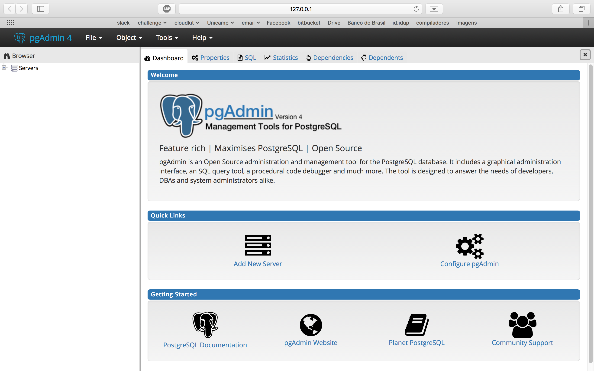
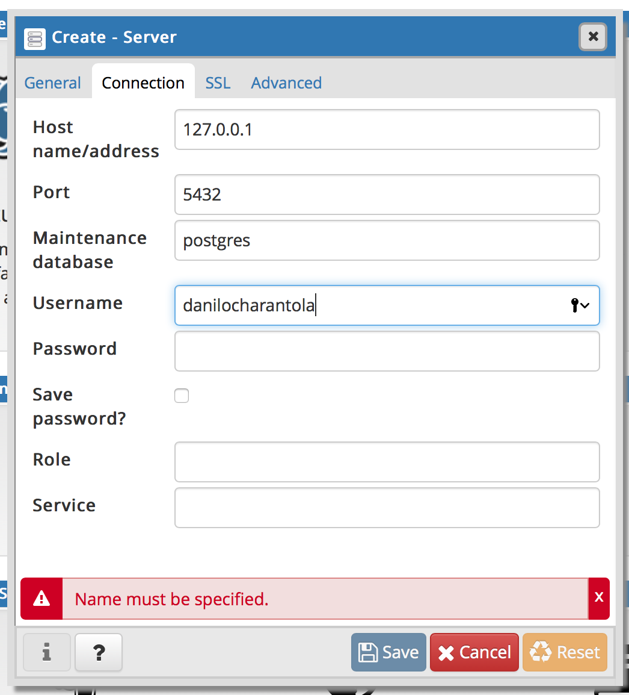
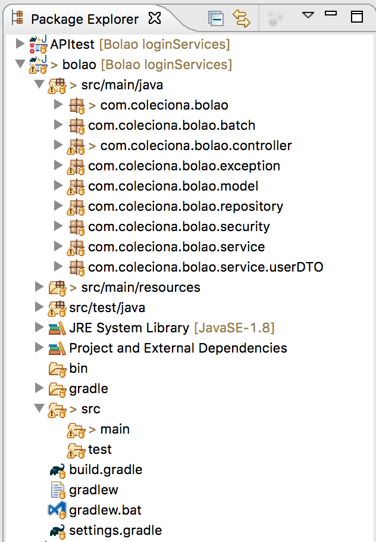

# Spring Boot com PostgreSQL

## Instalando o PostgreSQL

Para instalar o postgreSQL, basta baixar a versão mais recente dele [aqui](https://www.enterprisedb.com/downloads/postgres-postgresql-downloads) e seguir o processo de instalação. Quando terminar, abra o pgAdmin. Você deve observar uma tela assim:



Para iniciar o server, abra o terminal e execute o seguinte comando:

`pg_ctl -D /usr/local/var/postgres -l logfile start`

Feito isso, crie um servidor, clicando com o botão direito em **Servers** no pg admin. Depois, **create > server**.

Dê um nome ao seu servidor, depois vá em **Connection** e insira 127.0.0.1 no **host name / address**. Também altere o **Username**:



Feito isso, salve e depois clique com o botão direito no serve criado e depois em **create > database**. Então, dê um nome para o seu bd e salve.

## Configurações iniciais

Ao criar o projeto, você pode selecionar a opção para importar o PostgreSQL e o repositório JPA e assim ele adicionará as dependências automaticamente. Mas, se você esqueceu, pode abrir o arquivo build.gradle e adicionar manualmente as dependências no final do arquivo:

```java
dependencies {
	// add JPA repository dependece
	compile('org.springframework.boot:spring-boot-starter-data-jpa')
	// add postgreSQL dependece
	runtime('org.postgresql:postgresql')
	...
}
```

Feito isso, você precisa configurar o arquivo **application.properties** na pasta **src/main/resources**. Para isso, abra o arquivo e adicione as seguintes propriedades:

```python
# configura o spring pra usar postgres
spring.datasource.platform=postgres
spring.database.driverClassName=org.postgresql.Driver
# informa a url para o bd
spring.datasource.url=jdbc:postgresql://localhost:5432/BolaoDatabase
# username do postgres
spring.datasource.username=danilocharantola
# porta do servidor
server.port=8080

# configura o jpa para usar o postgres
spring.jpa.database=POSTGRESQL
spring.jpa.show-sql=true
# apaga o banco de dados e cria a tabela novamente toda vez que o servidor for iniciado
# você deve mudar essa propriedade depois. Ela só é útil nos testes iniciais
spring.jpa.hibernate.ddl-auto=create-drop

# ativa o uso de repositorios jpa
spring.data.jpa.repositories.enabled=true
spring.jpa.properties.hibernate.enable_lazy_load_no_trans=true
spring.jpa.generate-ddl=false
spring.jpa.open-in-view=true
spring.jpa.show-sql=false
```

## Arquitetura do projeto

Uma vez realizada as configurações iniciais para utilizar o postgreSQL, vamos ver como organizar o código de acordo com a arquitetura MVC. Na imagem abaixo, podemos ver a arquitetura utilizada no Palpita. O mais importante na imagem é a divisão em model, controller, service e repository.



Em model, temos as classes que modelam a aplicação: Apostas, Campeonatos, Partidas, Usuários...

Em controller temos os endpoints, ou seja, o controller recebe requisições HTTP e as responde, acessando os services para isso.

O service é responsável por realizar a comunicação entre o controller e o banco de dados, acessando o repositório para buscar os dados e formatando ele para entregar ao controller.

Por fim, o repositório é responsável por fazer as consultas ao banco de dados.

Para criar essas pastas, clique com o botão direito na pasta **src/main/java**, depois em **new > package**.

## Operações CRUD (Create, Read, Update, Delete)

Para exemplificar como realizar as operações CRUD, vamos utilizar a classe de times utilizada no Palpita.

### Model

Primeiramente, vamos criar o model de um time. Clique com o botão direito na pasta **model**, depois em **new > class**.

No nosso modelo, um time terá apenas um id e um nome:

``` java
public class Team {
	
	private Long id;
		
	private String name;
}
```

Também teremos métodos de get e set, assim como hashCode() e equals() para facilitar as buscas. Para gerar esses métodos automaticamente, clique com o botão direito em qualquer lugar do arquivo, depois em **source > generate getters and setters** e em **source > generate hashCode and equals**.

Gere getters e setters para o id e o nome. E quando for gerar hashCode() and equals(), selecione apenas o id.

Feito isso, vamos adicionar as anotações para informar ao spring como mapear essa classe para o banco de dados.

A primeira anotação é **@Entity** que é utilizada para indicar que esta classe é uma tabela do BD.

```java
@Entity
public class Team {
	...
}
```

Se desejar, você pode alterar o nome da classe no banco de dados, passando o nome desejado na anotação: **@Entity(name = "meuNome")**

Feito isso, vamos anotar a propriedade id como o identificador da tabela no banco de dados:


```java
@Id
@GeneratedValue(strategy = GenerationType.IDENTITY)
private Long id;
	
```
A anotação **@generatedValue** faz com que os valores do id sejam gerados automaticamente, assim não precisamos nos preocupar em garantir que os ids sejam únicos.

Por fim, vamos anotar o campo nome como uma coluna da tabela no banco de dados:

```java
@Column(nullable=false, unique=true)
private String name;
```

Nesse caso, o nome não pode ser null e precisa ser único. Também é possível alterar o nome da coluna, indicar seu tamanho, indicar se ela pode ou não ser atualizada, entre outros.

### Controller

Vamos agora criar o controller que recebe e trata as requisições HTTP relacionadas ao time.

```java
public class TeamController {
	//retorna todos os times
	public List<Team> getAllTeams() {}
	// retorna o time com o id informado
	public Team getTeam(Long id) {}
	// cria um novo time
	public void addTeam(Team team) {}
	// atualiza um time
	public void updateTeam(Team team, Long id) {}
	// remove um time
	public void deleteTeam(Long id) {}
}
```

Primeiramente, devemos adicionar a anotação **@RestController** para indicar que a classe é um controller:

```java
@RestController
public class TeamController {
	...
}
```

Agora, vamos utilizar uma anotação para mapear o método getAllTeams a uma URL:

```java
@RequestMapping("/teams")
public List<Team> getAllTeams() {...}
```

Assim, quando for realizada uma requisição **GET** na url **localhost:8080/teams** o método getAllTeams será chamado.

Para o método que recebe um id e retorna o time correspondente, precisamos adicionar mais algumas informações: Além da URL, é preciso informar o id do time desejado:

```java
@RequestMapping("/teams/{id}")
public Team getTeam(@PathVariable Long id) {...}
```

A anotação **@PathVariable** indica que o valor da variável id será obtido a partir do id informado na url. Assim, ao fazer uma requisição **GET** na url **localhost:8080/teams/1** o valor da propriedade id será 1.

> **Obs:** garanta que o nome da propriedade anotada com **@PathVariable** é igual ao nome entre chaves na url da anotação **@RequestMapping**

Agora, para criar um time, precisamos mapear o método a uma URL e informar que ele deve ser chamado com uma requisição HTTP do tipo **POST**. Além disso, temos que extrair todas as informações do time a partir do corpo da requisição:

```java
@RequestMapping(method=RequestMethod.POST, value="/teams")
public void addTeam(@RequestBody Team team) { ... }
```

Basta adicionar a anotação **@RequestBody** para que o spring entenda que deve extrair as informações de um time do JSON passado no corpo da mensagem. Assim, ele fará isso de forma automática e passará um objeto Team para o método addTeam.

O método de update é análogo aos anteriores, porém deve ser acessado a partir de uma requisição **PUT**:

```java
@RequestMapping(method=RequestMethod.PUT, value="/teams/{id}")
public void updateTeam(@RequestBody Team team, @PathVariable Long id) { ... }
```

Por fim, o método de remoção deve ser mapeado em uma requisição HTTP do tipo **DELETE**:

```java
@RequestMapping(method=RequestMethod.DELETE, value="/teams/{id}")
public void deleteTeam(@PathVariable Long id) { ... }
```

Para implementar os métodos, precisaremos utilizar o service do team e, consequentemente, uma referência para ele. Basta utilizar a anotação **@Autowired** para que o spring instancie o sevice automaticamente.

```java
@RestController
public class TeamController {
	@Autowired
	private TeamService teamService;
	...
}
```

Finalmente, vamos implementar os métodos:

```java
@RequestMapping("/teams")
public List<Team> getAllTeams() {
	return teamService.getAllTeams();
}
	
@RequestMapping("/teams/{id}")
public Team getTeam(@PathVariable Long id) {
	return teamService.getTeam(id);
}
	
@RequestMapping(method=RequestMethod.POST, value="/teams")
public void addTeam(@RequestBody Team team) {
	teamService.addTeam(team);
}
	
@RequestMapping(method=RequestMethod.PUT, value="/teams/{id}")
public void updateTeam(@RequestBody Team team, @PathVariable Long id) {
	teamService.updateTeam(id, team);
}
	
@RequestMapping(method=RequestMethod.DELETE, value="/teams/{id}")
public void deleteTeam(@PathVariable Long id) {
	teamService.deleteTeam(id);
}
```

### Service

O service deve conter as implementações dos métodos usados anteriormente pelo controller e, para isso, precisará acessar o repositório, tendo uma referência para ele. Da mesma forma que anteriormente, utilizaremos a anotação **@Autowired**. E o service deve ser marcado com a anotação **@Service**.

```java

@Service
public class TeamService {
	
	@Autowired
	private TeamRepository teamRepository;
	
	public List<Team> getAllTeams() {
		return teamRepository.findAll();
	}
	
	public Team getTeam(Long id) {
		Optional<Team> checkExistantTeam = teamRepository.findById(id);
		if (checkExistantTeam.isPresent()) {
			return checkExistantTeam.get();	
		} else {
			throw new EntityNotFoundException(Team.class.getName(), id);
		}
	}
	
	@Transactional
	public void addTeam(Team team) {
		teamRepository.save(team);
	}

	@Transactional
	public void updateTeam(Long id, Team team) {
		Optional<Team> checkExistantTeam = teamRepository.findById(id);
		if (checkExistantTeam.isPresent()) {
			teamRepository.save(team);
		} else {
			throw new EntityNotFoundException(Team.class.getName(), id);
		}		
	}

	@Transactional
	public void deleteTeam(Long id) {
		Optional<Team> checkExistantTeam = teamRepository.findById(id);
		if (checkExistantTeam.isPresent()) {
			teamRepository.deleteById(id);
		} else {
			throw new EntityNotFoundException(Team.class.getName(), id);
		}
	}
}

```

> **Obs:** EntityNotFoundException é uma classe criada por nós para representar um erro ao tentar editar ou remover uma entidade não encontrada. Sua implementação foi apresentada no tutorial de configurações iniciais do spring boot.
> **Obs2:** Note que alguns métodos foram anotados com **@Transactional**. Essa anotação indica que o conteúdo do método deve ser executado em uma transação no banco de dados, sendo realizado por completo e lidando com problemas de dependencia entre os acessos. Essa anotação deve ser adicionada aos métodos que realizam escritas no bd.

### Repository

Por fim, vamos implementar o repositório que irá acessar o banco de dados e obter os dados. 
Clique com o botão direito na pasta Repository e depois em **new > Interface**.

Então, adicione o seguinte código:

```java
public interface TeamRepository extends JpaRepository<Team, Long> {
		
}
```

E agora, não precisamos fazer mais **NADA**. Ao definir a interface TeamRepository como herdeira de JpaRepository, o spring implementa automaticamente os métodos básicos para salvar, atualizar, remover, buscar todos e buscar por id.

E, caso seja necessário utilizar métodos mais complexos, o spring também auxilia muito. Por exemplo, se quisessemos buscar um time pelo nome, bastaria definir um método utilizando um formato padrão, de forma que o spring compreendesse automaticamente o que aquele método deveria fazer e fizesse a implementação. Em outras palavras, basta apenas definir o método:

```java
public interface TeamRepository extends JpaRepository<Team, Long> {
	Team findByName(String name);
}
```

O spring faz um parse do nome e identifica que é uma operação de busca (porque inicia com "find") pelo campo nome (porque tem "By" e depois "Name").

Outros exemplos podem ser observados no repositório de uma aposta. No nosso modelo, há um relacionamento entre uma aposta e uma partida de forma que 1 aposta pertence a uma partida e 1 partida tem várias apostas. O repositório é definido da seguinte forma:

```java
public interface BetRepository extends JpaRepository<Bet, Long> {
	List<Bet> findByMatchId(Long matchId);
	Long countByMatchId(Long matchId);
}
```

Ao definir o método findByMatchId, o spring realiza o parser e encontra primeiro o atributo "Match", então entende que deve utilizar o relacionamento entre a aposta e partidas. Depois, ao encontrar "Id", já sabe que este Id é referente à partida e não à aposta. Portanto, este método retorna todas as apostas de uma partida.

O segundo método se inicia com "count", indicando que deve contar a quantidade de apostas em uma partida.

Há ainda outras opções, como definir métodos para buscar informações e ordenar por algum campo. Então, se precisar de um método um pouco diferente, procure a documentação.

Alguns exemplos da documntação são:

```java
interface PersonRepository extends JpaRepository<User, Long> {
  List<Person> findByEmailAddressAndLastname(EmailAddress emailAddress, String lastname);

  // Enables the distinct flag for the query
  List<Person> findDistinctPeopleByLastnameOrFirstname(String lastname, String firstname);
  List<Person> findPeopleDistinctByLastnameOrFirstname(String lastname, String firstname);

  // Enabling ignoring case for an individual property
  List<Person> findByLastnameIgnoreCase(String lastname);
  // Enabling ignoring case for all suitable properties
  List<Person> findByLastnameAndFirstnameAllIgnoreCase(String lastname, String firstname);

  // Enabling static ORDER BY for a query
  List<Person> findByLastnameOrderByFirstnameAsc(String lastname);
  List<Person> findByLastnameOrderByFirstnameDesc(String lastname);
}
```

Por fim, se for necessário um método ainda mais complexo, de forma que o spring não consiga compreender o que aquele método deve fazer apenas pela definição, é possível anotar o método com **@query** e passar como parâmetro uma query SQL. Não vou entrar em detalhes como fazer isso, mas é bom saber que é possível.

## Relacionamento entre classes

Quando estamos desenvolvendo uma aplicação, provavelmente precisaremos definir relacionamentos entre as classes do nosso modelo, e estes podem ser de 1 pra 1, 1 pra N, ou N pra N. Para criar estes relacionamentos no banco de dados, basta utilizar anotações.

### Relacionamento 1 pra 1

No palpita, por exemplo, um usuário pode criar ligas de apostas e convidar seus amigos e, ao fazer isso, pode customizar as regras sobre como calcular a pontuação. Dessa forma, nosso modelo contem uma classe **League** para armazenar as informações das ligas e uma classe **ScoreRules** para armazenar as configurações da liga. Como 1 liga tem 1 regra específica para calcular a pontuação e cada regra pertence a uma única liga, temos um relacionamento de 1 para 1.

Para definir este relacionamento, precisamos utilizar a anotação **@OneToOne**:

```java
@Entity
public class League {
	@OneToOne(cascade = {CascadeType.PERSIST, CascadeType.MERGE})
	@JoinColumn(name="rules_id", referencedColumnName="id", nullable=false)
	private ScoreRules scoreRules;
	...
}
```

Note que o cascade type foi definido como persist e merge. Assim, ao criar uma liga, suas regras também serão criadas e, ao atualizar seus dados, as regras também serão atualizadas se necessário.

A anotação **@JoinColumn** define que a tabela **League** terá uma **chave estrangeira** com nome **rules_id**, que referencia o campo **id** da tabela **scoreRules**. E, ainda, este campo não pode ser null. Ou seja, a liga precisa ter um scoreRules.

Caso você deseje acessar uma liga a partir do model da classe scoreRules, você também pode adicionar um campo League a essa classe e utilizar a anotação OneToOne:

```java
@Entity
public class ScoreRules {
	@OneToOne(mappedBy="scoreRules")
	private League league;
	...
}
```

O campo mappendBy indica que, no banco de dados, a tabela scoreRules não terá uma chave estrangeira para a tabela League, ou seja, que ela não é a "dona" da relação, sendo mapeada pelo campo scoreRules no model da liga.

Entretanto, essa implementação tem um problema, porque ao buscar uma liga, ela irá buscar as regras da liga (utilizando o campo scoreRules) e, ao buscar as regras, a liga será buscada novamente devido ao campo league na classe ScoreRules, entrando em loop infinito. Por isso, é necessário utilizar a anotação **@JsonIgnore** na classe scoreRules. Assim, ao buscar as regras, a liga não será buscada.


```java
@Entity
public class ScoreRules {
	@OneToOne(mappedBy="scoreRules")
	@JsonIgnore
	private League league;
	...
}
```

### Relacionamento 1 pra N

No palpita, temos uma classe para representar os campeonatos de futebol e outra para representar as ligas de apostas. Neste casos, cada liga de aposta pertence a 1 campeonato, enquanto um campeonato pode ter várias ligas de apostas. Portanto, temos um relacionamento de 1 para N.

Para definir este relacionamento no spring, utilizamos anotações de forma análoga ao caso 1 para 1:

```java
@Entity
public class League {
	@ManyToOne
	@JoinColumn(name="championship_id", referencedColumnName="id", nullable=false)
	private Championship championship;
	...
}
```

A anotação **@ManyToOne** deve ser lida da seguinte forma: muitas ligas (classe dentro da qual está a anotação) para um campeonato (campo anotado).

> Obs: se desejar manter uma referencia do campeonato para as ligas, basta realizar o procedimento análogo ao do relacionamneto 1 para 1, mas agora com a anotação **@OneToMany**.

### Relacionamento N para N

No palpita, ainda, um usuário (apostador) pode participar de várias ligas e uma liga tem vários usuários, constituindo um relacionamento N para N.

```java
@Entity
public class Gambler {
	@ManyToMany
	@JoinTable(name = "gambler_leagues", 
			   joinColumns = {@JoinColumn(name="league_id", referencedColumnName="id")},
			   inverseJoinColumns = {@JoinColumn(name="user_id", referencedColumnName="id")})
	private List<League> leagues;
	...
}
```

No caso do relacionamento N para N, em vez de utilizarmos a anotação **@JoinColumn**, precisamos da anotação **@JoinTable**. Essa anotação recebe como parâmetro o nome da tabela que fará a ligação entre apostadores e ligas; e as joinColumns para as duas tabelas.

## Referências

1. Integração com o postgreSQL
	
	[Download postgreSQL](https://www.enterprisedb.com/downloads/postgres-postgresql-downloads)

	[Tutorial em vídeo de uma aplicação simples](https://www.youtube.com/watch?v=kighQ0NWJlg&t=652s&frags=pl%2Cwn)
	
2. JPA repository
	
	[Documentação Jpa Repository - criando queries](https://docs.spring.io/spring-data/jpa/docs/current/reference/html/#repositories.query-methods.details)
	
	[Documentação Spring - queries com @query](https://docs.spring.io/spring-data/jpa/docs/1.5.0.RC1/reference/html/jpa.repositories.html)

3. Relacionamentos 1 para 1
		
	[Callicoder](https://www.callicoder.com/hibernate-spring-boot-jpa-one-to-one-mapping-example/)
	
	[hellokoding](https://hellokoding.com/jpa-one-to-one-foreignkey-relationship-example-with-spring-boot-maven-and-mysql/)
	
4. Relacionamentos 1 para N

	[hellokoding](https://hellokoding.com/jpa-one-to-many-relationship-mapping-example-with-spring-boot-maven-and-mysql/)

5. Relacionamentos N para N
	
	[Callicoder](https://www.callicoder.com/hibernate-spring-boot-jpa-many-to-many-mapping-example/)